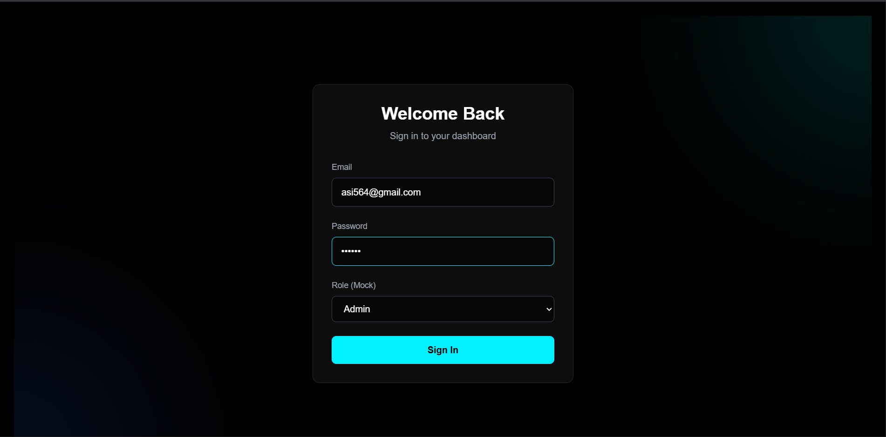
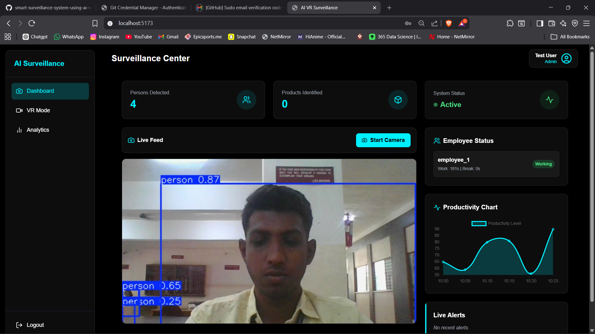
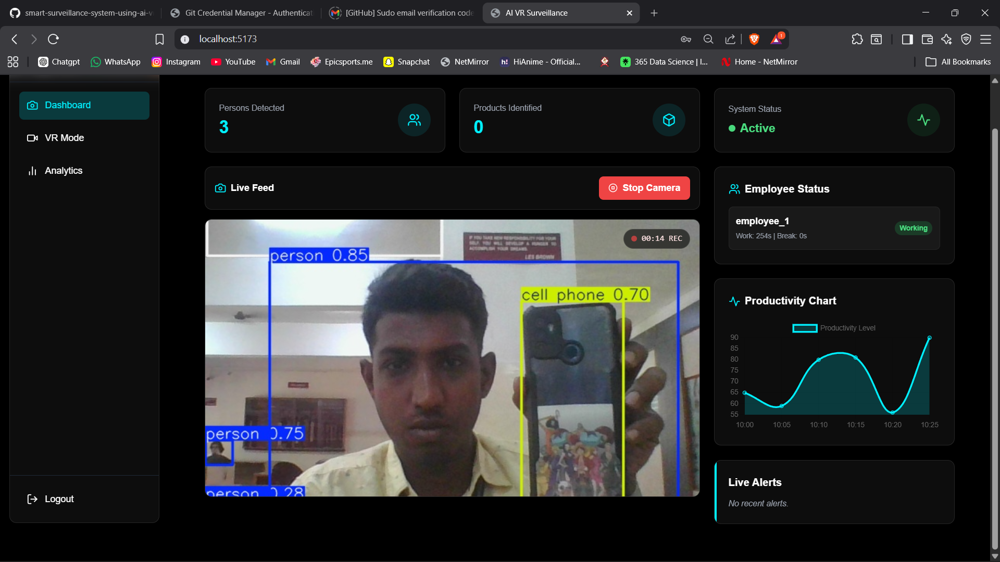
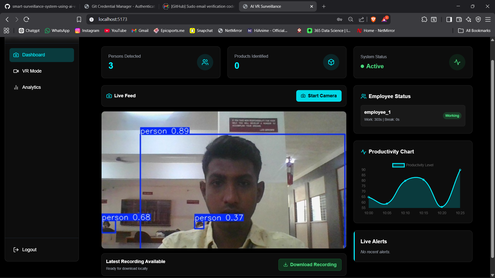
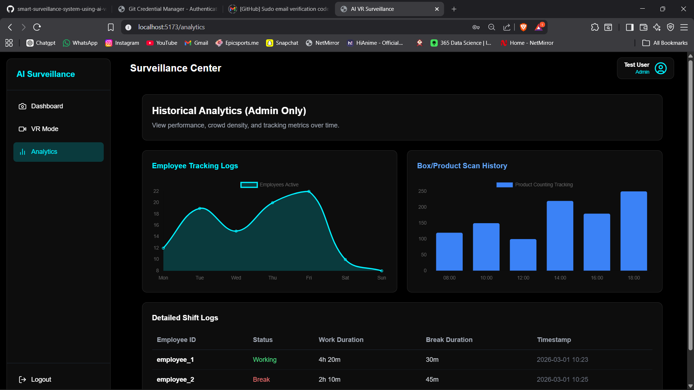
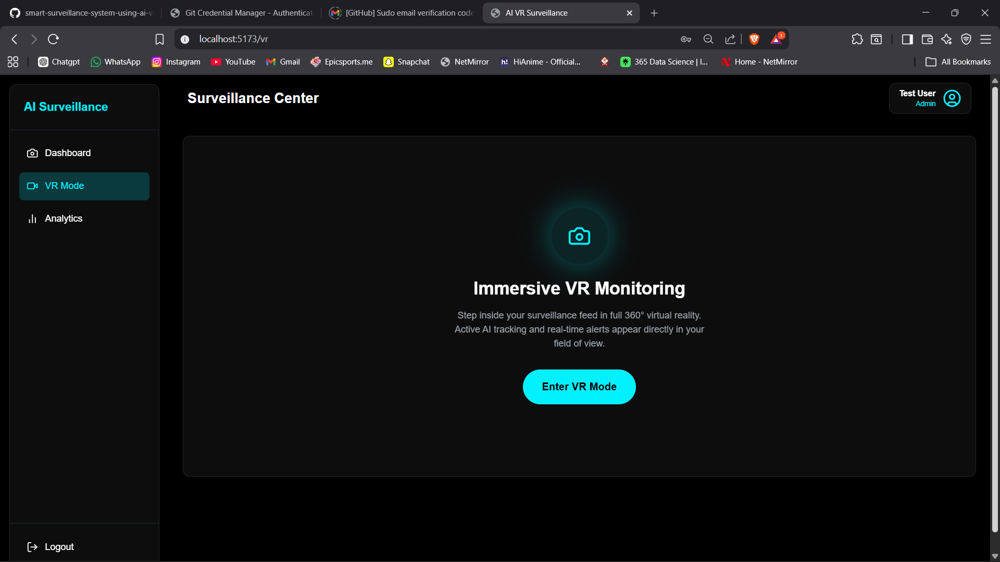

# AI + VR Enabled Smart Surveillance System

A comprehensive, full-stack smart surveillance application featuring real-time object detection, duration tracking, immersive VR monitoring, and local screen recording.

## 🎯 Problem Statement
Traditional surveillance systems require continuous human monitoring. This project automates detection using AI to improve efficiency and security.

## 🚀 Future Scope
- Face recognition integration
- Cloud deployment
- Mobile notifications
- Real-time alerts via SMS/Email

## 👨‍💻 Team
- Aryan Indalkar
- Kartik Choudhari
- Sonali Gaikwad
- Bhumika Alhat

## 🧱 Technology Stack

### Frontend
- **React.js (Vite)**
- **Tailwind CSS** (for styling and glassmorphism UI)
- **Socket.io-client** (for real-time dashboard updates)
- **Chart.js & React-Chartjs-2** (for analytics visualization)
- **A-Frame** (for 360° VR Mode wrapper)
- **MediaRecorder API** (Native browser API for local screen/camera recording)

### Backend
- **Node.js & Express.js**
- **MongoDB (Mongoose)** (Storage for users, events, and recordings)
- **Socket.io** (Websocket broadcasting from AI to Frontend)

### AI Module (Microservice)
- **Python & Flask** (REST API)
- **Ultralytics (YOLOv8)** (For Person and Product Detection)
- **OpenCV** (Camera Stream Capture)

---

## 📁 Project Structure

```text
ai-vr-surveillance/
│
├── backend/               # Node.js + Express + Socket.io + MongoDB
│   ├── server.js          # Entry point
│   ├── socket.js          # Socket server configuration
│   ├── routes/            # API endpoints (Auth, etc.)
│   ├── models/            # Mongoose Schemas (User, Event, Recording)
│   └── controllers/       # Controller logic for routes
│
├── ai-engine/             # Python + YOLOv8 Microservice
│   ├── app.py             # Flask application
│   ├── detect.py          # YOLO object detection logic
│   ├── tracker.py         # Logic to track "Working" vs "Break" duration
│   └── requirements.txt   # Python dependencies
│
└── frontend/              # React (Vite) Frontend
    ├── index.html         # Main HTML (A-Frame embedded)
    ├── src/
    │   ├── App.jsx        # React Router configuration
    │   ├── pages/         # View Pages (Login, Dashboard, VRView, Analytics)
    │   ├── components/    # Reusable UI (Sidebar, TopBar)
    │   └── context/       # Auth state management
    ├── tailwind.config.js # Styling configurations
    └── package.json       # React dependencies
```

---

## 🚀 How to Run the Project Locally

Because this system uses microservices, you need to run the Backend, Python Engine, and Frontend simultaneously in **three separate terminal window tabs**.

### 1️⃣ Start the Node.js Backend

1. Open Terminal 1 and navigate to the backend folder:
   ```bash
   cd "v:\smart survillience system\ai-vr-surveillance\backend"
   ```
2. Install dependencies:
   ```bash
   npm install
   ```
3. Start the server (runs on port 5000):
   ```bash
   npm start
   ```

### 2️⃣ Start the Python AI Engine

1. Open Terminal 2 and navigate to the ai-engine folder:
   ```bash
   cd "v:\smart survillience system\ai-vr-surveillance\ai-engine"
   ```
2. Create and activate a Virtual Environment (Recommended):
   - **For Windows:**
     ```bash
     python -m venv venv
     venv\Scripts\activate
     ```
   - **For Mac/Linux:**
     ```bash
     python3 -m venv venv
     source venv/bin/activate
     ```
3. Install dependencies:
   ```bash
   pip install -r requirements.txt
   ```
4. Start the engine (runs on port 5001):
   ```bash
   python app.py
   ```

### 3️⃣ Start the React Frontend

1. Open Terminal 3 and navigate to the frontend folder:
   ```bash
   cd "v:\smart survillience system\ai-vr-surveillance\frontend"
   ```
2. Install dependencies:
   ```bash
   npm install
   ```
3. Start the Vite development server:
   ```bash
   npm run dev
   ```
4. Open your browser and go to the link provided (usually `http://localhost:5173`).

---

## 🎯 Features Workflow

1. **Dashboard & Recording:** 
   Log in to access the Dashboard. You can view the Live Feed. Click **Start Camera** to begin media stream capture and simultaneously start an auto-recording session using MediaRecorder. When you hit **Stop Camera**, a `.webm` file is auto-downloaded to your local machine.
2. **AI Detection & Websockets:** 
   While `app.py` is running, logic inside `detect.py` mock tracks objects contextually, checks presence durations via `tracker.py`, and posts to `http://localhost:5000/api/ai/data`. The socket server broadcasts it to the frontend live.
3. **VR Mode:** 
   Navigate to the **VR Mode** tab and click Enter. A-frame wraps your media stream onto a 360-degree virtual construct with spatial overlay warnings when crowd detection triggers.
4. **Analytics:**
   For `Admin` role accounts, the Analytics tab renders productivity line graphs using Chart.js based on the simulated collected data logs.

## 📸 Screenshots

### 🔐 Login Page


### 📊 Dashboard


### 🎥 Camera Start


### 🛑 Camera Stop


### 🧠 Detection / Monitoring


### 🥽 VR Mode
